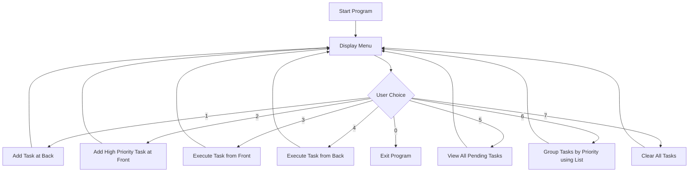

---

# ✅ Task Scheduler using Deque & List (C++)

A **menu-driven console-based Task Scheduler** built using **C++ STL containers** like `deque` and `list`.
This project allows users to add, execute, view, group, and clear tasks with priority handling from both ends.

---

## 🚀 Features

✅ Add normal and high-priority tasks
✅ Execute tasks from **front or back**
✅ View all pending tasks
✅ Group tasks by priority
✅ Clear all scheduled tasks
✅ Menu-driven user interface

---

## 🧰 Concepts Used

| Concept                    | Purpose / Where Used                                 |
| -------------------------- | ---------------------------------------------------- |
| `deque`                    | Store tasks and execute from front/back              |
| `list`                     | Group and organize tasks by priority                 |
| `cin.ignore() + getline()` | Input handling for task names without newline issues |
| `switch-case`              | For interactive user menu                            |
| `clear()`                  | Remove all elements from the deque                   |

---

## 🧠 Scheduler Flow — Task Processing Logic



---

## 🎯 Sample Run

```
========== Task Scheduler Menu ==========
1. Add Task
2. Add High Priority Task
3. Execute Task from Front
4. Execute Task from Back
5. View Pending Tasks
6. Group Tasks by Priority
7. Clear All Tasks
0. Exit
=========================================
Enter your choice: 1

Enter Task ID: 101
Enter Task Name: Debug Feature
Enter Priority (1–10): 6
✅ Task 'Debug Feature' added successfully!

Enter your choice: 2
Enter High Priority Task ID: 102
Enter Task Name: Fix Urgent Bug
Enter Priority (1–10): 9
🔥 High Priority Task 'Fix Urgent Bug' added at front!

Enter your choice: 5
📝 Pending Tasks:
 - [ID: 102] Fix Urgent Bug (Priority: 9)
 - [ID: 101] Debug Feature (Priority: 6)

Enter your choice: 3
⚙️ Executing Task (Front): Fix Urgent Bug

Enter your choice: 0
👋 Exiting... Goodbye!
```

---

## 📦 How to Run

1️⃣ Copy the `.cpp` file into your project folder
2️⃣ Compile using g++ (or any C++ compiler):

```bash
g++ task_scheduler.cpp -o scheduler
```

3️⃣ Run the executable:

```bash
./scheduler
```

---
